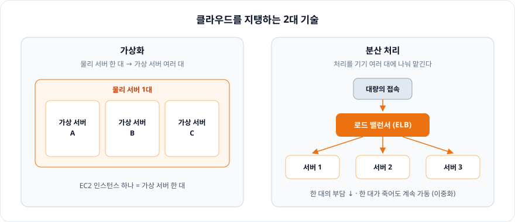
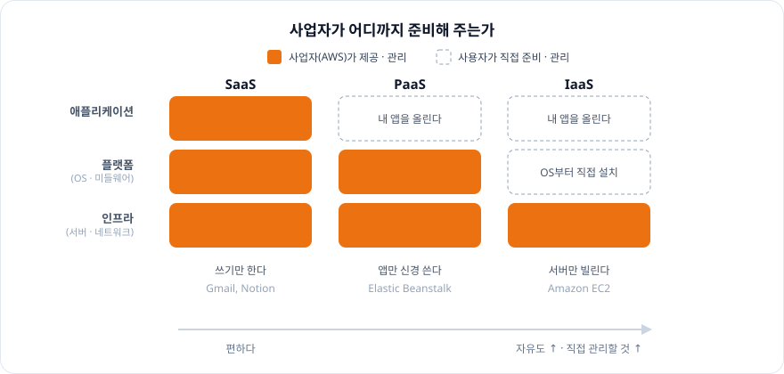
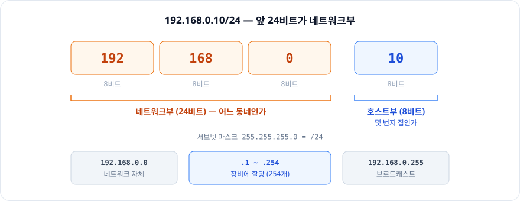
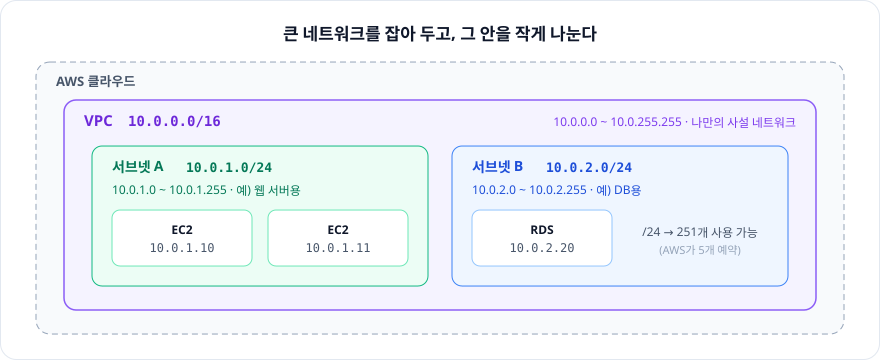
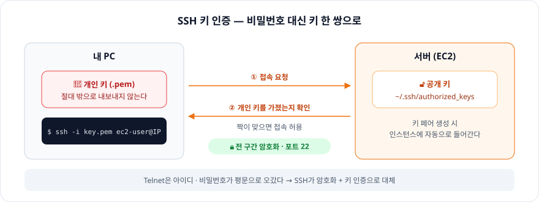

# 2장. AWS를 이해하기 위한 클라우드 & 네트워크의 구조

> AWS의 서비스는 결국 **서버를 쪼개고(가상화) 나눠 맡기는(분산 처리)** 기술 위에 서 있고,
> 그 서버들은 **IP 주소와 서브넷**으로 나뉜 네트워크 안에 놓인다. 콘솔에서 보던 VPC · 서브넷 · Elastic IP가 여기서 나온다.

※ 2.4 서버와 인스턴스는 한 줄 메모, 2.7 웹의 구조는 **SSH**만 정리했다.

<br/>

## 2.1 클라우드와 온프레미스

**클라우드 컴퓨팅**: 서버 · 스토리지 · 네트워크 같은 자원을 직접 사서 두지 않고, 네트워크 너머의 사업자에게서 **필요한 만큼 빌려 쓰는** 방식

| 구분 | 설비 | 자원을 늘리려면 |
|---|---|---|
| **온프레미스** | 회사가 서버를 직접 사서 자기 건물(데이터 센터)에 둔다 | 장비를 새로 사서 설치 |
| **클라우드** | 사업자(AWS)의 데이터 센터에 있는 자원을 빌린다 | 콘솔에서 늘리기만 하면 된다 |

<br/>

## 2.2 가상화와 분산 처리 — 클라우드를 지탱하는 2대 기술

| 기술 | 한 줄 정의 |
|---|---|
| **가상화** | 물리 서버 **한 대**에 가상 서버 **여러 대**를 만든다 |
| **분산 처리** | 처리를 기기 **여러 대**에 나눠서 맡긴다 |

### 분산 처리가 필요한 이유

1. 서버 한 대로 처리할 수 없을 만큼 접속이 몰린다
2. → 같은 기능 · 정보를 가진 서버 여러 대에 **분배**해서 처리한다
3. → 서버 한 대의 부담이 줄고, 응답 불가나 다운을 막을 수 있다

- 요청을 여러 서버에 나눠 주는 장치가 **로드 밸런서(LB)** → AWS에서는 **ELB**(Elastic Load Balancing)로 제공
- **이중화**: 시스템이나 서버 하나에 문제가 생겨도 **계속 가동**할 수 있도록 여분을 두는 조치



<br/>

## 2.3 SaaS · PaaS · IaaS — 클라우드의 서비스 제공 형태

"사업자가 **어디까지** 준비해 주느냐"로 나뉜다.

| 형태 | 사업자가 제공하는 범위 | 사용자가 하는 일 | 예시 |
|---|---|---|---|
| **SaaS** (Software as a Service) | 인프라 + 플랫폼 + **애플리케이션** | 완성된 소프트웨어를 쓰기만 한다 | Gmail, Notion |
| **PaaS** (Platform as a Service) | 인프라 + **플랫폼**(OS · 미들웨어 · 실행 환경) | 애플리케이션만 올린다 | AWS Elastic Beanstalk |
| **IaaS** (Infrastructure as a Service) | **인프라**(서버 · 네트워크 · 스토리지) | OS부터 직접 설치 · 관리한다 | Amazon EC2 |

→ 아래로 갈수록 **자유도는 높고, 직접 관리할 것도 많다.**



<br/>

## 2.4 서버와 인스턴스

- EC2에서는 서버를 **인스턴스**라는 단위로 생성한다 (= 클라우드 위에 만든 가상 서버 한 대)

<br/>

## 2.5 LAN — LAN을 구성하는 기술

**LAN** (Local Area Network): 회사나 가정에서 PC · 서버를 네트워크로 연결해 **서로 통신할 수 있게** 하는 방식

- **유선 LAN / 무선 LAN**
- **사내 LAN**: 인터넷에 연결하지 않고 회사 안에서만 쓰는 네트워크는 **인트라넷**이라고 부른다

### LAN을 구성하는 6가지 요소

| 요소 | 역할 |
|---|---|
| **라우터** | 서로 다른 네트워크를 연결하고, 패킷을 어느 네트워크로 보낼지 정한다 |
| **허브** (스위치) | 같은 네트워크 안의 기기들을 케이블로 묶어 준다 |
| **방화벽** (FW) | 정해진 규칙에 맞지 않는 통신을 막는다 |
| **DMZ** | 외부에 공개할 서버(웹 서버 등)를 두는 구역. 내부망과 인터넷 사이의 완충 지대 |
| **DHCP** | 네트워크에 붙은 기기에 IP 주소를 **자동으로 할당**한다 |
| **서브넷** | 큰 네트워크를 작게 나눈 단위 |

> 이 6가지는 6장 VPC에서 그대로 다시 나온다. 라우터 → **라우트 테이블**, 방화벽 → **보안 그룹 · 네트워크 ACL**, DMZ → **퍼블릭 서브넷**.

<br/>

## 2.6 IP 주소와 DNS — 네트워크의 장소를 특정하는 방법

### IP 주소의 종류

| 구분 | 어디서 쓰나 | 특징 |
|---|---|---|
| **사설 IP 주소** | 사내 LAN, 가정 LAN | 네트워크 안에서만 유효. 다른 LAN과 겹쳐도 된다 |
| **공인 IP 주소** | 인터넷 | 관리 기관이 관리해서 **전 세계에서 중복되지 않는다** |

- **DHCP**: 가정 · 회사의 사설 IP는 DHCP가 각 호스트에 할당한다. 할당된 주소는 **유효 기간**이 있어서 지나면 재할당된다 → PC나 프린터의 IP가 때에 따라 바뀌는 이유
- **Elastic IP**: 클라우드 서버는 껐다 켤 때마다 IP가 바뀔 수 있다. AWS의 Elastic IP를 쓰면 **고정 IP 주소**로 접속할 수 있다
- **DNS**: 도메인 이름 ↔ IP 주소를 변환한다. AWS에서는 **Route 53**이 DNS 서비스다

### 네트워크부와 호스트부

IP 주소는 두 부분으로 나뉜다.

| 부분 | 의미 | 비유 |
|---|---|---|
| **네트워크부** | 어떤 네트워크에 소속되어 있는가 | 동네 |
| **호스트부** | 그 네트워크 안의 어느 호스트인가 | 집 번지 |

**어디까지가 네트워크부인지는 서브넷 마스크가 정한다.**

```
192.168.0.10/24
서브넷 마스크 255.255.255.0 = 앞 24비트가 네트워크부
```

- `/24` → 호스트부 8비트 → 주소 256개 (장비에 줄 수 있는 건 **254개**)
- `/16` → 호스트부 16비트 → 훨씬 큰 동네

254개인 이유는, 호스트부 양 끝 주소를 장비에 줄 수 없기 때문이다.

| 주소 | 용도 |
|---|---|
| `192.168.0.0` (호스트부 전부 0) | **네트워크 자체**를 가리킨다 |
| `192.168.0.1` ~ `192.168.0.254` | 장비에 할당 |
| `192.168.0.255` (호스트부 전부 1) | 네트워크 전체에 뿌리는 **브로드캐스트** |



### 실무에서 마주치는 지점 — VPC와 서브넷

AWS에서 VPC를 `10.0.0.0/16`으로 만들고, 그 안을 `10.0.1.0/24` 서브넷으로 쪼개는 게 정확히 이 개념이다.
**큰 네트워크부를 잡아 두고, 그 안을 작은 네트워크로 나누는 것.**

| 이름 | CIDR | 범위 | 의미 |
|---|---|---|---|
| **VPC** (Virtual Private Cloud) | `10.0.0.0/16` | `10.0.0.0` ~ `10.0.255.255` | AWS 안에 분양받은 **나만의 사설 네트워크** |
| **서브넷** | `10.0.1.0/24` | `10.0.1.0` ~ `10.0.1.255` | VPC를 **용도별로 나눈 구역** |

> ⚠️ AWS 서브넷은 2개가 아니라 **5개**를 예약한다. `/24`라면 쓸 수 있는 IP는 254개가 아니라 **251개**다.
> 네트워크 주소(`.0`), VPC 라우터(`.1`), DNS(`.2`), 예비용(`.3`), 브로드캐스트(`.255`)



<br/>

## 2.7 웹의 구조 — SSH

**SSH** (Secure Shell): 원격 서버에 **안전하게 접속해 명령을 실행**하는 프로토콜. 기본 포트는 **22**

### 왜 SSH인가

과거의 **Telnet**은 아이디 · 비밀번호가 **평문**으로 오갔다. SSH는 **전 구간을 암호화**해서 Telnet을 대체했다.

### 인증 방식 — 키 방식

| 키 | 어디에 두나 | 역할 |
|---|---|---|
| **개인 키** (`.pem`) | **내 PC** | 신원 증명. 절대 밖으로 내보내지 않는다 |
| **공개 키** | **서버** | 접속해 온 쪽이 짝이 맞는 개인 키를 가졌는지 확인 |

- 비밀번호를 네트워크로 보내지 않는다. 개인 키를 가진 사람만 접속할 수 있다
- EC2의 **키 페어**가 이것이다. 인스턴스를 만들 때 공개 키는 서버에 들어가고, 개인 키(`.pem`)는 한 번만 내려받을 수 있다

```
ssh -i my-key.pem ec2-user@<퍼블릭 IP>
```


