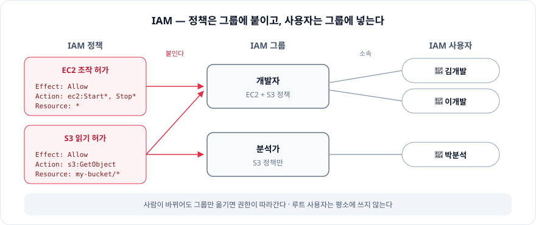
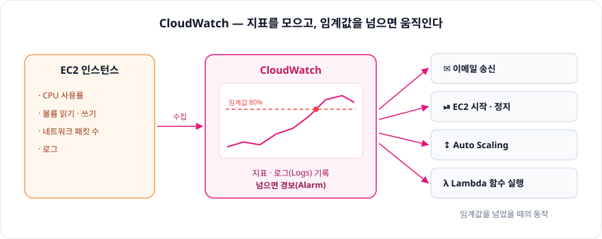
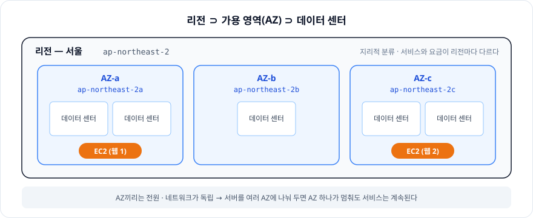

# 3장. AWS를 사용하기 위한 도구

> AWS는 **관리 콘솔**에서 조작하고, **IAM**으로 누가 무엇을 할 수 있는지 정하고,
> **CloudWatch**로 상태를 지켜보고, **Billing**으로 돈을 확인한다. 이 모든 조작은 **리전** 단위로 이루어진다.

※ 3.1 AWS 계정 만들기는 **루트 사용자**만 정리했다.

<br/>

## 3.1.4 루트 사용자

**루트 사용자**: AWS 계정을 만들 때 쓴 **이메일 주소로 로그인**하는 사용자. 계정의 **모든 권한**을 가진다

- 결제 정보 변경, 계정 해지까지 할 수 있다 → 털리면 계정 전체가 넘어간다
- 그래서 평소 작업은 루트 사용자가 아니라, 필요한 권한만 준 **IAM 사용자**로 한다 (3.3)
- 루트 사용자에는 **MFA**(다요소 인증)를 걸어 두고, 꼭 필요할 때만 쓴다

<br/>

## 3.2 관리 콘솔과 대시보드 — 심플하고 직관적인 관리 도구

### 3.2.1 관리 콘솔이란?

**관리 콘솔**: 웹 브라우저에서 AWS의 각 서비스를 조작하는 화면

### 3.2.2 리전 선택

- 관리 콘솔은 **리전**(지역) 단위로 조작한다
- 콘솔 오른쪽 위에서 리전을 고른다. 서울 리전은 `ap-northeast-2`
- 리전을 잘못 고르면 **만들어 둔 인스턴스가 안 보인다** → 리소스는 만든 리전에만 있다
- IAM, Route 53, CloudFront처럼 리전과 관계없는 **글로벌 서비스**도 있다 (리전 표시가 "글로벌")

### 3.2.3 대시보드

- 관리 콘솔에는 **서비스별로 메뉴**가 있고, 각 화면에서 조작한다
- **대시보드**: 서비스를 조작하는 화면의 **메인 화면**. 그 서비스의 리소스 현황을 한눈에 보여준다

<br/>

## 3.3 AWS IAM과 접근 권한 — 접근 권한 설정

### 3.3.1 AWS IAM이란?

**IAM** (Identity and Access Management): AWS의 **인증** 기능. 각 서비스에 대한 **접근을 관리**한다

### 3.3.2 IAM 그룹과 IAM 정책

| 구성 요소 | 역할 |
|---|---|
| **IAM 사용자** | AWS를 조작하는 사람(또는 프로그램) 한 명 |
| **IAM 그룹** | 같은 권한을 주고 싶은 사용자를 묶어 **일괄로 관리** |
| **IAM 정책** | 누가 **어떤 서비스에 무엇을 할 수 있는지** 정한 규칙 |

- 정책은 사용자에게 직접 붙일 수도 있지만, **그룹에 붙이고 사용자를 그룹에 넣는** 게 관리하기 쉽다
- 사람이 바뀌어도 그룹만 옮기면 권한이 따라간다



### 3.3.3 IAM 정책 설정하기

정책은 세 가지를 정한다.

| 무엇을 정하나 | 예시 | 정책 JSON의 키 |
|---|---|---|
| **무엇에 대하여** | EC2 서버, S3 버킷 | `Resource` |
| **어떤 조작을** | 시작 및 정지, 파일 쓰기 및 읽기, 삭제 | `Action` |
| **허가할지 말지** | 허가 / 거부 | `Effect` (`Allow` / `Deny`) |

```json
{
  "Version": "2012-10-17",
  "Statement": [
    {
      "Effect": "Allow",
      "Action": ["s3:GetObject", "s3:PutObject"],
      "Resource": "arn:aws:s3:::my-bucket/*"
    }
  ]
}
```

→ "`my-bucket` 안의 파일을 **읽고 쓰는 것**을 **허가**한다"

> 권한은 **필요한 만큼만** 준다 (최소 권한 원칙). 편하다고 `AdministratorAccess`를 붙이면 루트 사용자와 다를 게 없다.

<br/>

## 3.4 Amazon CloudWatch — Amazon EC2의 리소스 상태 감시

### 3.4.1 Amazon CloudWatch란?

**CloudWatch**: 각 AWS 서비스의 리소스를 **모니터링 · 관리**하는 서비스

- 각 서비스에서 **지표**(메트릭)와 **로그**를 수집 · 기록한다
- **임계값**을 넘으면 알림을 보낸다 (**CloudWatch 경보**)

감시하는 지표 (EC2 기준):

- CPU 사용률
- 볼륨의 읽기 · 쓰기 횟수, 바이트 수
- 네트워크 송수신 패킷 수

임계값을 넘었을 때 할 수 있는 일:

| 동작 | 예시 |
|---|---|
| **이메일 송신** | 담당자에게 알림 (Amazon SNS 경유) |
| **EC2 작동** | 인스턴스 시작 · 정지 · 재부팅 |
| **Auto Scaling** | 인스턴스 **수**를 늘리거나 줄인다 |
| **Lambda 함수 실행** | 임의의 프로그램을 실행 |



### 3.4.2 사용 가능한 조작과 Amazon CloudWatch Logs

**CloudWatch Logs**: 각종 **로그를 기록**하는 기능

- Lambda 함수를 실행할 때의 로그가 자동으로 여기에 쌓인다
- 애플리케이션 로그 같은 **범용적인 로그**도 모아 둘 수 있다

<br/>

## 3.5 AWS Billing and Cost Management — AWS의 비용 관리

### 3.5.1 AWS Billing and Cost Management란?

AWS 요금과 관련된 일을 모아 둔 서비스

- **요금 납부**
- **사용료 모니터링**
- 비용 · 사용 현황 **보고**

> AWS는 쓴 만큼 내는 종량제라, 끄는 걸 잊은 인스턴스가 그대로 요금이 된다. **AWS Budgets**로 예산 알림을 걸어 두면 안전하다.

<br/>

## 3.6 리전과 가용 영역 — 세계 각국에 존재하는 데이터 센터

### 3.6.1 리전과 가용 영역

| 이름 | 의미 |
|---|---|
| **리전** (Region) | 데이터 센터의 **지리적 분류**. 예) 서울 `ap-northeast-2`, 도쿄 `ap-northeast-1` |
| **가용 영역** (AZ, Availability Zone) | 리전 안에 있는, **물리적으로 독립된** 설비. 예) `ap-northeast-2a`, `ap-northeast-2c` |

- 각 리전에는 여러 AZ가 **서로 떨어진 곳에** 독립된 전원 · 네트워크로 설치되어 있다
- AZ는 클라우드의 독립된 파티션이다. **여러 AZ를 함께 쓰면** 한 AZ에 장애가 나도 서비스가 멈추지 않는다 (2장의 이중화)

> ⚠️ 노트에 "리전 = 일종의 데이터 센터"라고 적었는데, 정확히는 **리전 ⊃ AZ ⊃ 데이터 센터**다.
> 리전은 여러 AZ(보통 3개 이상)를 묶은 **지역**이고, AZ 하나가 데이터 센터 **하나 이상**으로 이루어진다.



### 3.6.2 리전과 서비스

- 리전은 **서비스 제공의 모체**다
- 리전에 따라 **제공되는 서비스와 제공되지 않는 서비스**가 있다 → 새 서비스는 일부 리전에서 먼저 나오기도 한다
- 리전마다 **요금도 다르다**
